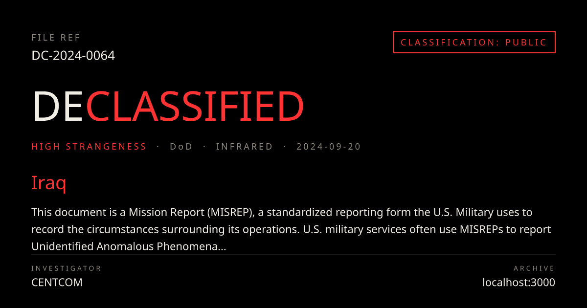

# DECLASSIFIED

> *Play this while you read* → [The X-Files Theme · Mark Snow](https://www.youtube.com/watch?v=lpqAIHvN5Ow)

An interactive 3D visualization of 158 declassified UAP files released by the Pentagon at [war.gov/ufo](https://www.war.gov/ufo/). The user is the investigator. The site boots up like a 1970s government terminal, then drops them onto a pulsing globe of sightings to explore, declassify, and connect.



## What it does

- **Cinematic boot** — terminal-style reveal: `INITIATING ARCHIVE…` / `ACCESSING 158 FILES…` / `CASE #YYYY-XX-NNNN` / `ESTABLISHING CONNECTION…` / `ACCESS GRANTED`. Skippable, suppressed for the rest of the session.
- **3D globe** — `react-globe.gl` with a dark-Earth texture, cyan graticule, atmosphere rim. Each sighting pulses in its strangeness color: phosphor (routine), amber (unresolved), red-alert (high strangeness). Marker size encodes duration, glow encodes confidence.
- **Dossier panel** — slide-in on click. Typewriter reveal of the report with inline `[REDACTED]` bars that tear open on click and flash phosphor as the text underneath fades in. Per-sighting hooks for the iconic cases.
- **Timeline 1947 → 2026** — year-bucketed histogram + draggable playhead + PLAY mode that scrubs cinematically at 7 years/sec. Markers appear and fade as you cross their dates.
- **Audio (off by default)** — synthesized WebAudio: hover pings on markers, typewriter clacks on dossier reveal, ambient noise bed, low-A drone that rises when the timeline plays.
- **Your Local Anomaly** — one-time geolocation request, finds the nearest case, generates a shareable preview card with optional investigator credit + a per-case `/sighting/[id]` URL backed by `next/og` (1200×630) for X / Reddit share previews.
- **AI Analyst** — Claude (sonnet-4-6) returns a 5-bucket plausibility breakdown + a neutral one-line quote, via `tool_use` for strict JSON. Top-3 similar cases pulled from a precomputed similarity matrix. BYO-key panel stores your Anthropic key in `localStorage` so you can run the analyst without us shipping a server key.
- **Connections mode** — cyan arcs glow between cases with similar descriptions. Composes with the timeline scrubber: connections thin out as the playhead moves back. Click any case in the dossier's Connections section to walk the graph.
- **Filter rail** — left-edge slide-in, multi-axis filtering by agency / sensor / strangeness. Live `N / total` count, composes with timeline and Connections.
- **User submissions** — submit a sighting → Claude moderation → if approved, lands on the globe with a `[USER-SUBMITTED]` tag. Stored only in your browser.

## What's actually in this dataset

This is the **real Pentagon release**: 158 records from the May 8 2026 batch at [war.gov/ufo](https://www.war.gov/ufo/). Descriptions, agencies, dates, and PDF links are pulled verbatim from the source CSV — no paraphrasing. Six worth opening first:

| Case | Year | Agency | Why it lands |
|---|---|---|---|
| [`DC-2024-0064`](public/screenshots/hero-iraq-misrep.png) | 2024 | DoD / CENTCOM | The top-strangeness real case. A Mission Report (MISREP) on a UAP encounter in Iraq, score 7. |
| [`DC-2025-0100`](public/screenshots/og-fbi-302.png) | 2025 | FBI | An FBI 302 interview with a senior US intelligence official giving a firsthand UAP encounter account. |
| [`DC-2026-0102`](public/screenshots/og-fbi-vault.png) | 1947–68 | FBI | Case file 62-HQ-83894 — investigative records, eyewitness testimony, photographic evidence from Oak Ridge, and technical proposals on propulsion. |
| [`DC-1969-0013`](public/screenshots/og-apollo-12.png) | 1969 | NASA | Apollo 12. The fourth crewed mission to the Moon. |
| [`DC-1965-0011`](public/screenshots/og-gemini-7.png) | 1965 | NASA | Gemini 7 air-to-ground transcript. Borman & Lovell, in low Earth orbit. |
| [`DC-1985-0025`](public/screenshots/og-png-cable.png) | 1985 | State | Diplomatic cable from the U.S. Embassy in Port Moresby, Papua New Guinea, to USCINCPAC. |

Every case is rendered server-side at `/sighting/[id]` with a `next/og` share card. The PNGs above are produced live by the same route. Each record also keeps the actual war.gov PDF URL on `mediaUrl` so future versions can link straight to the source document.

## Tech

Next.js 14 (App Router) · TypeScript · Tailwind · `react-globe.gl` · Framer Motion · Zustand · WebAudio (synthesized in-browser, no audio files) · `@anthropic-ai/sdk` (Claude `sonnet-4-6` via `tool_use`) · `next/og` (1200×630 share cards).

**The shipped dataset is now live** — 158 real records from the May 8 2026 release, ingested via the pipeline below. The UI shows `DATASET · LIVE`. The hand-curated mock used during development is still available via `npm run data:mock`.

Pipeline ([scripts/](scripts/)):

```bash
npm run data:scrape   # crawl an index page, download artifacts → data/raw/
npm run data:extract  # ask Claude to extract Sighting records from each file
npm run data:geocode  # resolve approximate locations via Nominatim
npm run data:embed    # cosine similarity — Voyage AI if VOYAGE_API_KEY set, else TF-IDF
npm run data:build    # all four stages in sequence
```

Default source is the inline CSV at `https://www.war.gov/Portals/1/Interactive/2026/UFO/uap-csv.csv` (linked from [war.gov/ufo](https://www.war.gov/ufo/)). Scrape falls back to the Wayback Machine snapshot of that URL when the live origin returns Akamai 403 (which it currently does for non-browser clients). Override with `DECLASSIFIED_SOURCE_URL=…` for any future re-release. Records' real PDF URLs from the source CSV are preserved on each sighting's `mediaUrl` field.

## Run locally

```bash
npm install
npm run data:mock   # generates data/sightings.json + similarities.json deterministically
npm run dev
# http://localhost:3000
```

To run the **AI Analyst** and **user submissions** flows, supply an Anthropic API key one of two ways:

- **BYO-key** (default): in the browser, open any dossier → AI Analyst → ▸ bring your own anthropic key. Stored only in `localStorage`. Sent to `/api/analyze` as `X-Anthropic-Key`. Never logged.
- **Server-side**: drop `ANTHROPIC_API_KEY=sk-ant-…` into `.env.local`. The route prefers the server key; per-IP rate limiting (20/hr) is applied in that mode.

## Build + deploy

```bash
npm run build       # production build — verifies types, generates routes
npm start           # serves the production build locally
```

Deploys cleanly to Vercel — the OG image route runs on the Node runtime (`runtime = "nodejs"`); set `ANTHROPIC_API_KEY` as an environment variable if you want server-side analysis.

## Tone + scope

- **No claims about what anything *is*.** The AI Analyst is constrained at the system-prompt level to avoid the words *alien*, *extraterrestrial*, *spacecraft*, or any origin claim.
- **The `[REDACTED]` bars are a visualization device.** Source files were not redacted in this specific way — the dossier footer says so explicitly.
- **Audio is opt-in.** Never auto-plays.
- **No backend, no signup.** Submissions are local to your browser. Investigator name is local to your browser.

## Build order (commit log)

The repo's history is the build order — one commit per step:

1. `bootstrap` — Next 14 + TS + Tailwind + fonts + color tokens
2. `data pipeline + mock dataset` — 162 deterministic sightings + similarity matrix
3. `3D globe with pulsing markers`
4. `dossier panel + redaction reveal`
5. `timeline scrubber 1947→2026`
6. `boot sequence + synthesized audio`
7. `real scrape pipeline` — `scrape.ts` (cheerio), `extract.ts` (Claude PDF/image extraction with `tool_use`), `geocode.ts` (Nominatim, 1 req/sec), `embed.ts` (Voyage AI or TF-IDF fallback). Source URL pluggable via `DECLASSIFIED_SOURCE_URL`.
8. `local anomaly + OG share cards`
9. `AI analyst with BYO-key fallback`
10. `connections mode — glowing arcs between similar cases`
11. `filter rail + user submissions + moderation`
12. `polish + README + deploy prep`

## Contributing

Open an issue or PR. Style is hand-rolled — no shadcn/ui defaults. Components live in `components/`, accessor and pipeline code in `lib/` and `scripts/`. Run `npm run typecheck` before pushing.

## License

MIT.

---

**DATA SOURCE: war.gov/ufo · THIS IS A FAN PROJECT, NOT AFFILIATED WITH ANY GOVERNMENT.**
